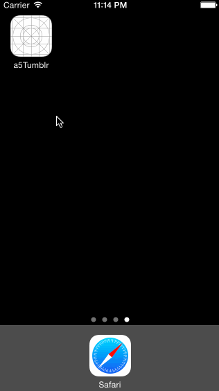

#Tumblr
##Tumblr iOS prototype at Codepath

**Hours: 8**

**Project Requirements:**

For the Tumblr assignment, we created a custom tab bar controller. Tapping on Home, Search, Account, or Trending shows the respective screen and highlight the tab bar button.

The Compose button presents the screen modally, and fades as the buttons animate in and out.

The Login button animates the login form over the view controller.
